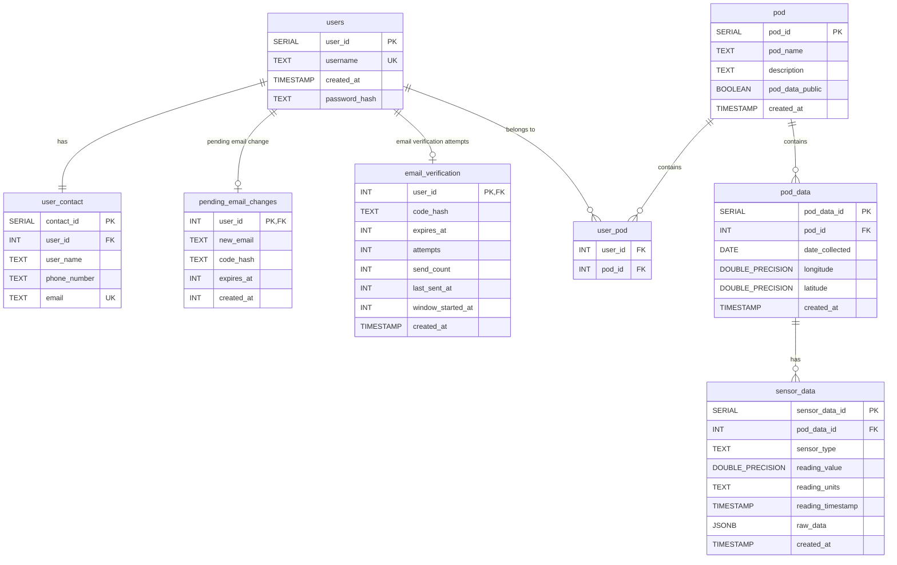

# Database Schema Diagrams

This document contains UML diagrams for the database schema.

## Entity Relationship Diagram

## Database Schema Overview

### Relationships
- **users → user_contact**: One-to-one (one user has one contact entry)
- **users → pending_email_changes**: One-to-zero/one (temporary pending email change verification state)
- **users → email_verification**: One-to-zero/one (temporary signup/login verification state)
- **users ↔ pod**: Many-to-many (users can belong to multiple pods, pods can have multiple users) via `user_pod` junction table
- **pod → pod_data**: One-to-many (one pod can have multiple data entries)
- **pod_data → sensor_data**: One-to-many (one pod_data entry can have multiple sensor readings)

### Indexes
- `idx_user_contact_user_id` on `user_contact(user_id)`
- `idx_email_verification_expires` on `email_verification(expires_at)`
- `idx_pending_email_changes_expires` on `pending_email_changes(expires_at)`
- `idx_user_pod_user_id` on `user_pod(user_id)`
- `idx_user_pod_pod_id` on `user_pod(pod_id)`
- `idx_pod_data_pod_id` on `pod_data(pod_id)`
- `idx_pod_data_date` on `pod_data(date_collected)`
- `idx_sensor_data_pod_data_id` on `sensor_data(pod_data_id)`
- `idx_sensor_data_timestamp` on `sensor_data(reading_timestamp)`

### Constraints
- All foreign key relationships use `ON DELETE CASCADE`
- `users.username` is UNIQUE
- `user_contact.user_id` is UNIQUE (one-to-one relationship)
- `user_contact.email` is UNIQUE
- `pending_email_changes.user_id` is PRIMARY KEY and references `users(user_id)`
- `email_verification.user_id` is PRIMARY KEY and references `users(user_id)`
- `user_pod` has a composite primary key on `(user_id, pod_id)`
