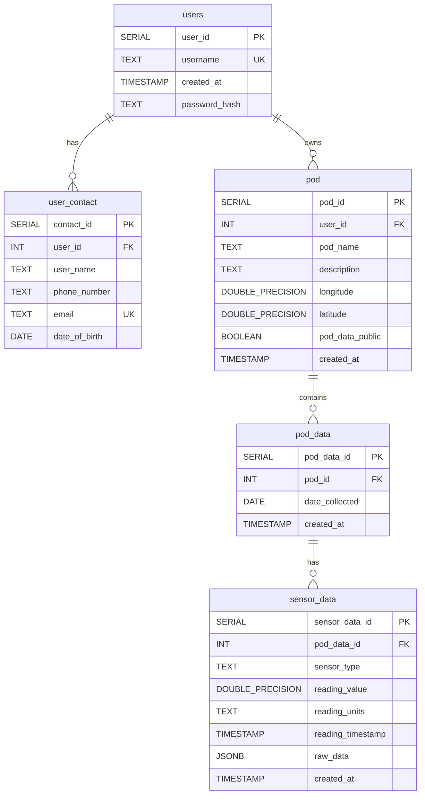

# Database Schema Diagrams

This document contains UML diagrams for the database schema.

## Entity Relationship Diagram

## Database Schema Overview

### Relationships
- **users → user_contact**: One-to-many (one user can have multiple contact entries)
- **users → pod**: One-to-many (one user can own multiple pods)
- **pod → pod_data**: One-to-many (one pod can have multiple data entries)
- **pod_data → sensor_data**: One-to-many (one pod_data entry can have multiple sensor readings)

### Indexes
- `idx_user_contact_user_id` on `user_contact(user_id)`
- `idx_pod_user_id` on `pod(user_id)`
- `idx_pod_data_pod_id` on `pod_data(pod_id)`
- `idx_pod_data_date` on `pod_data(date_collected)`
- `idx_sensor_data_pod_data_id` on `sensor_data(pod_data_id)`
- `idx_sensor_data_timestamp` on `sensor_data(reading_timestamp)`

### Constraints
- All foreign key relationships use `ON DELETE CASCADE`
- `users.username` is UNIQUE
- `user_contact.email` is UNIQUE

